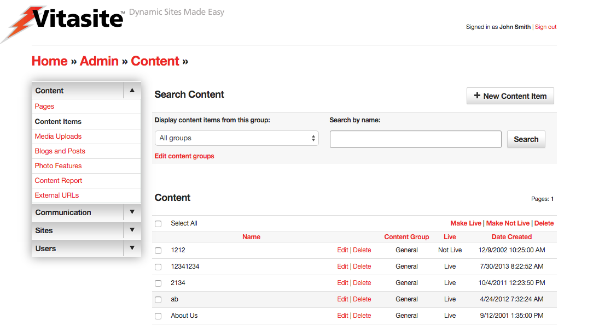
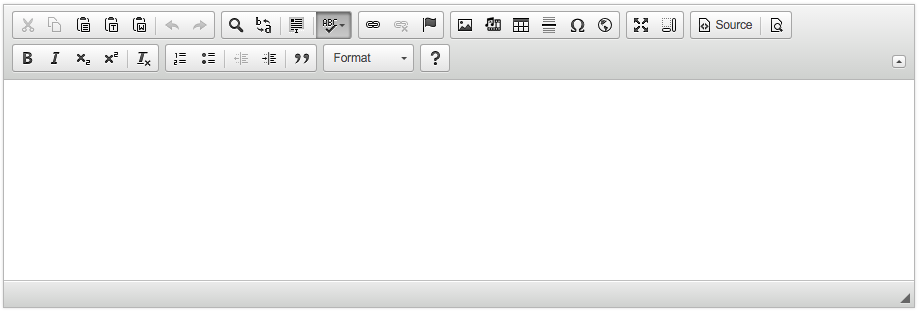

# Content Items

Content Items make up the bulk of the text on your site. Pages are the placeholders; providing an address to which a user can navigate and save a bookmark. Content items are the filler on those pages. You can place multiple content items on a page, and you can use one content item on many pages. When you change a content item, it is automatically updated in all the pages where it is used on your site.

The Content Editor tool is used to create content items, edit content properties, edit the content itself, and delete content items. You can access the Content Editor by clicking on the “Content Items” link in the left navigation bar, within the "Content" section on any administrative page. Alternatively, you can click on “Content Items" link in the body of the main administrative screen.

_Figure 1_

A representation of the main Content Editor screen is shown in Figure 1. On this screen you can see all the content items in your site. The top of the page contains a link allowing you to create new content items.

The bottom part of the screen lists your existing content items in alphabetical order. You can change the sort order by clicking on one of the other column header links. Next to each item is a check box that allows you to perform certain actions on one or more content items. The actions that can be taken are shown in the “Action” menu at the start of the content item listing.

You can also view a subset of the content items by selecting a group name from the “Display content items from group” menu, and clicking “Submit.” This will show only those content items that are part of that content group. You may also search for a specific content item by using the "Search by name" field and searching on the name of the content item the admin provided.

You can _create additional content groups_, or edit existing groups, by selecting the “Edit content groups” link near “Display content items from group” menu. Each content group has an optional setting that allows you to specify an email address for a person responsible for that content group. When any change is made to an item in that group, an email notification is sent to that address.

## Creating Content Items

To create a new content item, click the “New Content Item” link at the top of the main Content Editor page. This will open a new wizard, and display the fields for the process of creating a content item.

### Step One

Define the Properties for the Content Item. In this step, you will assign descriptive information about the content item using these fields:

**Select a Group** – This menu is used to assign this content item to a content group. It is a required field.

**Name** – This is the descriptive name used to identify the content item. When the content item is used as part of a content filter, this field is used as the headline for this content item. Otherwise, site visitors will not see this name.

**Live** – This check box determines whether this content item can be seen by your site visitors. If the content item is not live (the box is not checked), then visitors to your site will not see this item. Once you make the content item live (by checking the box and saving your changes), VitaSite will make it available for your web site visitors to see. This functionality allows you to work with an item in the administrative tools until you get it finished, without making it available on the site until it is ready.

**Private** – This check box is only available in a multiple sites installation of VitaSite. If this box is checked, this item can only be used on the site in which it is created. If this box is unchecked, it will be made available for use on other sites in the installation.

If you are creating a regular content item, you can proceed to Step 2. The following options only apply to content filters.

**Author** – This is an optional field used to identify the author of the content item. If the item is used in a content filter, the information in this field is shown to users as part of the content summary. Otherwise, site users do not see this field.

**Image Upload** - This is an optional field used to identify a thumbnail image for this content item when it is used in a content filter. The content filter settings further describe how the image is used.

Publish Date – This is an optional field used to determine when a content item should appear in a content filter. It only applies to content filters, and does not affect the appearance of the content item when it is inserted on a page.

Expire Date – This is an optional field used to determine when a content item should disappear in a content filter. It only applies to content filters, and does not affect the appearance of the content item when it is inserted on a page.

Summary – This is an optional field used to provide a short summary of the content item. It is only used when an item is part of a content filter, and the content filter has been set to show summaries.

Once you have completed these fields, you will generally proceed to the editor in [Step Two](#step-two).

### Step Two

Edit the content of the item. In this section you will work with the text and images that make up this item. 

_Figure 2_

The **Text** block uses a visual what-you-see-is-what-you-get (WYSIWYG) editor, which allows you to control the appearance of your content item without having to learn HTML. An image of the WYSIWYG editor is shown in Figure 2. You can learn more about the editor in the [Using the WYSIWYG Editor](#using-the-wysiwyg-editor) section below.

Once you have completed your text edits, use the **Save and Continue** button at the bottom of the wizard to continue. If you do not want to save your text edits, select the “cancel” link.

You can edit existing content items by clicking the “edit” link next to the name of the content item you wish to change. The edit process then works in the same way as the creation process described above.

## Using the WYSIWYG Editor

Because the editor can be customized from installation to installation depending on your requirements, an overview of the editor follows. Specific documentation on the WYSIWYG editor can be found at the <a href="http://docs.ckeditor.com/" target="_blank">CKEditor Docs</a> website.

If you have used a word processing tool (e.g. Microsoft Word, Google Docs, or Apple Pages) you already have a good idea on how to use a WYSIWYG editor, such as CKEditor. However the information below may be helpful if you are in need of a refresher, or cannot find information elsewhere. Generally, the actions you can perform using the WYSIWYG Editor include:

### Editing

* **Cut** - This button removes the selected text, and places it on the clipboard.
* **Copy** - This button copies the selected text to the clipboard.
* **Paste** - This button inserts the contents of the clipboard at the current text insertion point.
* **Paste as Plain Text** - This button opens a dialog where text on the user's clipboard can be pasted. Any text, styles, etc. are stripped down to their basic formats before being inserted into the editor. This option is helpful if you want to start formatting from scratch or are pasting from a source that is known to cause issues with the CKEditor.
* **Paste from Word** - The CKEditor allows you to keep basic formatting when you past a text fragment from Microsoft Word. This option is recommended for any text pasted into the editor from Microsoft Word, due to its known formatting issues.
* **Undo** - The Undo feature is a quick way to cancel the recently introduced change and restore the document to its previous state.
* **Redo** - The Redo feature lets you revert the last undo operation. This means that the document returns to the state it was in before you performed the undo.

### View

* **Find** - Allows the editor to find the specific text in the document.
* **Replace** - Allows the editor to find and replace specific text in the document.
* **Select All** - This button selects everything in the editor document.
* **Spell Check As You Type (SCAYT)** - SCAYT is a convenient option that lets you control the correctness of your document at the same time that you are writing it. SCAYT checks the text immediately after you write it and when it finds an error, it marks it with a red wavy line underneath the misspelled word. By default SCAYT is enabled. Any mistyped word may be corrected by right clicking (control+click on some Macs) and selecting the correct spelling from the suggested options within the menu. The toolbar menu has additional options not covered in this documentation.

### Typeface Options

* **Styles Menu** - This menu allows you to apply a style to your text using the styles defined in your site’s cascading style sheet. This feature may be disabled or not utilized.
* **Format Menu** - Described the paragraph format of the current line. By default the editor uses Paragraphs `
`. This menu allows you to change the current line to a Heading 1-6 (i.e. `<h1>`, `<h2>`, etc.) or a Division `
` element. There may be additional options depending on your installation.
* **Font Menu** -  This menu allows you to select the typeface for you text. This option may be disabled if your site uses a cascading style sheet.
* **Size Menu** -  This menu allows you to select the type size for you text. This option may be disabled if your site uses a cascading style sheet.
* **Font Color** - This button allows you to define the color of your text. This option may be disabled if your site uses a cascading style sheet.
* **Font Background Color** - This button allows you to define the background color, or highlight color, of your text. This option may be disabled if your site uses a cascading style sheet.

### Text Styling

* **Bold** - This button allows you to create bold text.
* **Italic** - This button allows you to create italic text.
* **Underline** - This button allows you to create underlined text.
* **Strike through** - This button allows you to create strike through text.
* **Subscript** - This button allows you to create subscript text.
* **Superscript** - This button allows you to create superscript text.
* **Remove Formatting** - This button will remove all formatting from the currently selected text. It will, however, preserve any changes from the Format menu.

### Text Layout

* **Ordered List** - This button allows you to create an ordered list. Place the insertion point where you want the list to start, then click this button once for each list item you want to create. Once you have created the list items, you can type the text that should appear next to each.
* **Unordered List** - This button allows you to create an ordered list. Place the insertion point where you want the list to start, then click this button once for each list item you want to create. Once you have created the list items, you can type the text that should appear next to each.
* **Indent Left** - Indents the current text to the left. When used in combination with the Ordered/Unordered lists, creates nested lists by indenting the current line down one level. If the last level is reached, it removes the list option from the current selection.
* **Indent Right** - Indents the current text to the right. When used in combination with the Ordered/Unordered lists, moves a list item up one level.
* **Block Quote** - Changes the currently selected text into a block quote.
* **Align Left** - This button aligns the current selection to the left. This option may be disabled if your site uses a cascading style sheet.
* **Align Center** - This button aligns the current selection to the center point. This option may be disabled if your site uses a cascading style sheet.
* **Align Right** - This button aligns the current selection to the right. This option may be disabled if your site uses a cascading style sheet.
* **Align Justify** - This button aligns the current selection using full justification. This option may be disabled if your site uses a cascading style sheet.

### Creating Rich Text

* **Insert Hyperlink** - This button opens the hyperlink dialog box, which allows you to create links. See [Creating Links](#creating-links) section below.
* **Remove Hyperlink** - This button will remove a hyperlink from the currently selected text, if any.
* **Insert Anchor** - Inserts an Anchor to a specific point in the text. Links can then direct a user to a that specific point either within the current document or from another one. It is best practice to write compound words with no spaces or replacing spaces with dashes (e.g. 'content,' 'contentitems' or 'content-items') and no capitals.
* **Insert Image** - This button opens the image dialog box, which allows you to insert an image into your content item. See [Inserting Images](#inserting-images) section below.
* **Insert Line** - This button inserts a horizontal rule.

### Additional Features

* **Source** - Allows the user to switch between the WYSIWYG view and the HTML code view.
* **Preview** - Opens the editor into a new window, showing the current working state.
* **Maximize** - Maximizes the editor to fit the entire screen.
* **Show Blocks** - Outlines elements within the editor to show the structure of the document.
* **Symbols** - When you are writing, it is often necessary to insert characters that are not a part of the standard keyboard. This is especially useful during the creation of documents in foreign languages that require various national letters. Another area where special characters are often needed is writing mathematical expressions.
* **iFrame** - CKEditor makes it possible to insert inline frames to a document. Inline frames, or `<iframe>` elements, allow you to insert a frame containing another document in the middle of your document.

### Additional Plugins

!!! note
    Not all plug-ins available are listed here. This section includes some commonly included plugins in Vitasite installations. Please contact your system administrator for more information and options for the CKEditor.
    
* **Embed Media from External Sites** - This Plugin allows you to insert embedded content (such as photos, videos, audio, and other rich media) via the OEmbed API. You only have to provide the URL to the site (It works also when the URL is shortened) you want to embed and the plugin does the rest. Examples of currently supported sites include: YouTube, Vimeo, Flickr, Instagram, SoundCloud, among several others.

### Inserting Images

_Documentation to come._

When you click the Insert Image button the dialog shown in Figure 8 is opened. This dialog allows you to choose the image you want to insert, and to define the parameters for the image.

The “Image Location” box allows you to specify which image you want to insert. If you have previously uploaded an image using the Media Uploads tool, select the “Uploaded Images” option. Then you can navigate to your image in the listing on the right.
If you are using an image from the Web, select the “URL” option and type the full address to the image you want to use.
The “Image Attributes” box allows you to specify optional parameters for your image. Once you have selected your image and assigned any optional parameters, click the “OK” button to insert your image into the text window.

### Creating Links

_Documentation to come._

When you click the Insert Hyperlink button the dialog shown in Figure 9 is opened. This dialog allows you to choose the hyperlink you want to insert, and to define any optional parameters.

If you are linking to a page from your VitaSite, choose the “Link” option. Then you will be able to navigate to the page you want using the window on the right.

If you are linking to an external resource, choose the “URL” option and type in the fill address. Once you click the “OK” button your link will be inserted into the text.

## Content Filters

_Documentation to come._