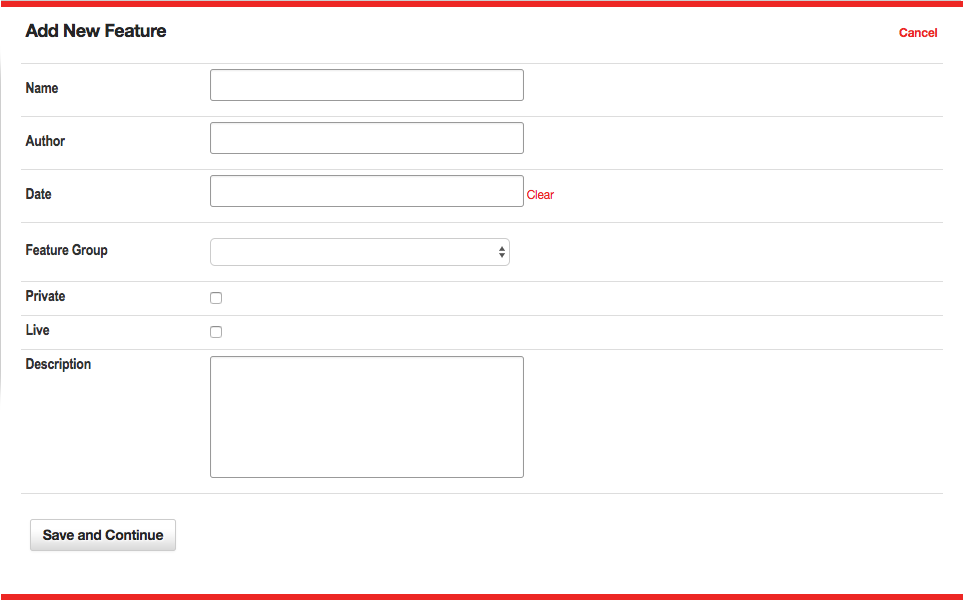
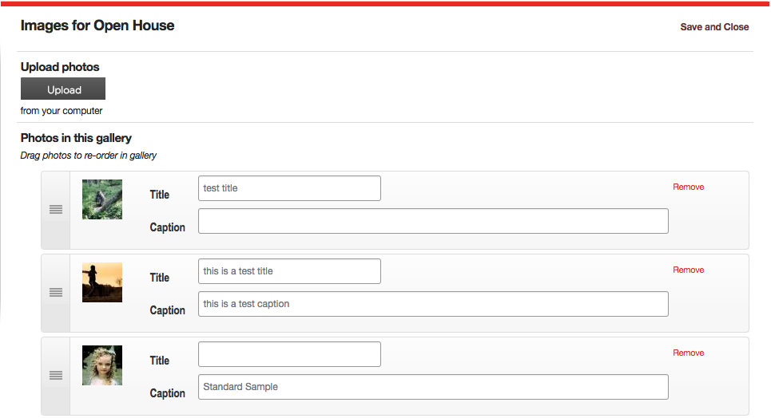
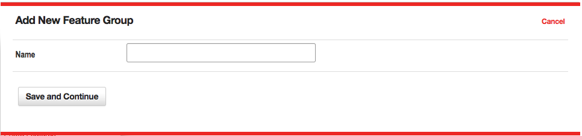
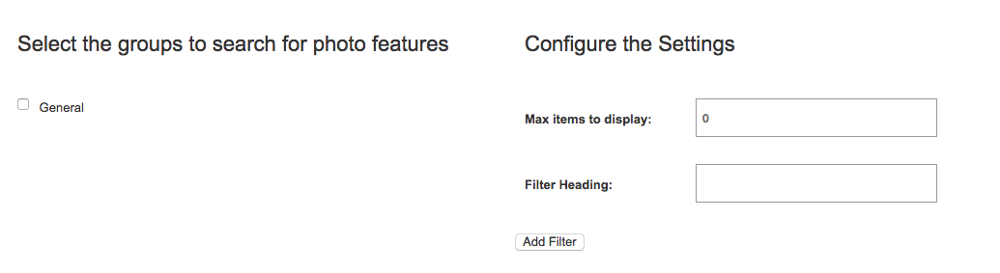

# Photo Features

The Photo Features tool is used to upload several images that are related, and that are to be displayed in a mini-gallery format. For example, suppose you have several images from a recent open house event. The photo features tool allows you to create a gallery of these images called Open House. When a user selects the Open House gallery, he or she will see a series of thumbnail images of the photos you uploaded.

When the user clicks on one of these images, the full-size version is displayed in a lightbox dialog. The user can then navigate to the next or previous image in the gallery by using the links that are created automatically for the gallery.

## Creating Photo Features

To create a new photo feature gallery, click the “New Photo Feature” link at the top of the main Photo Features page. This will open a new pop-up window wizard, and display the fields for the first step in the two-step process of creating a photo feature.

### Step One

*Figure 1*

Define the Properties for the Photo Feature shown in **Figure 1**. In this step, you will assign descriptive information about the photo feature using these fields:

* **Name** – This is the descriptive name used to identify the photo feature to site users. When a photo feature is inserted on a page, the name, author, date and description are displayed as a text item. The name is a link to the thumbnails page for the photo feature.
* **Author** – This is an optional field used to identify the author of the photo feature.
* **Date** – This is an optional field used to identify the date of the photo feature.
* **Feature Group** - This menu is used to assign this photo feature to a feature group. It is a required field.
* [**Private**](/#private) – This check box is only available in a multiple sites installation of VitaSite. If this box is checked, this item can only be used on the site in which it is created. If this box is unchecked, it will be made available for use on other sites in the installation.
* **Live** – This checkbox determines whether this photo feature can be seen by your site visitors. If the photo feature is not live (the box is not checked), then visitors to your site will not see this photo feature. Once you make the photo feature live (by checking the box and saving your changes), VitaSite will make it available for your web site visitors to see. This functionality allows you to work with a photo feature in the administrative tools until you get it finished, without making it available on the site until it is ready.
* **Description** – This field is used to describe the photo feature.

Once you have completed these fields, you can choose “Save and Continue,” to create the gallery. Currently the gallery is empty. To continue the creation process, choose "Images" from the main Photo Feature admin menu for the gallery you just created and coninue to step two.

### Step Two

*Figure 2*

Upload your images. In this step, you control the images associated with the photo feature as seen in **Figure 2**. You can do any of the following: upload images, delete images, change the order of existing images, and add or update titles and captions of each photo in the gallery.

#### Upload photos

This section includes an upload button to begin the process of uploading your images. You may select multiple images to upload at one time using this too.

#### Photos in this gallery

This section includes all the photos currently in your gallery. On the left hand side of each photo item, you'll find a handle that will allow you to drag-and-drop each item to reorder them. Next you will find a thumbnail of each photo in the gallery. You may set the following options for each photo:

* **Title** – Enter a descriptive title for this image.
* **Caption** – Enter a brief caption for this image.

If you have a photo in your gallery which you would like to remove, chose "Remove" and the photo will be deleted. All changes (e.g. reordering, adding titles or captions, or adding and removing images) are automatically applied in the background. You do not need to choose "Save" between changes.

Once you have finished editing the photo feature, click the “Save and Continue” button to exit the tool. You can now insert the photo feature on any page by using the page insertion wizard in the [Page Editor](page/#page-editor) tool.

## Photo Feature Groups

As [with all groups](/#groups), **Photo Feature Groups** shown in **Figure 3**, allow for an admin to organize their site's photo featuress into specific "folders." Photo feature groups can also be used to organize content for use in [Photo Feature Filters](#photo-feature-filters).

*Figure 3*

The options within a photo feature group set up are outlined below:

* **Name** - The name given to the specific Media Group.

## Photo Feature Filters

Photo Feature Filters are a powerful way of manipulating photo feature galleries, so that a page is updated automatically every time a new photo feature is created. If this if the first time you are setting up a filter, you might want to read the general concepts that apply to [all  filters](/#filters) within VitaSite. The following steps show how to insert a photo feature filter onto a page:

### Filters Step One

From the edit window for a page, click on a 'Add Item' insertion button to launch the page insertion wizard. This will open a new dialog window, with the first set of options.

Choose “Photo feature Filter” from the list in the page insertion wizard.

### Filters Step Two

*Figure 4*

This step shows two panes as seen in **Figure 4**.

* **Select the groups to filter** - In the left pane, select the group(s) you want to pull items from by placing a checkmark next to the group name.
* **Max items to display** - In the right pane, enter the number of items that you want to display.
* **Filter Heading** - The headline you want to display over this filter on the page.

Once you have done this, click “Add Filter.”

### Filters Step Three

The page insertion dialog closes, and the filter you created is added to the edit window. This filter will NOT appear on the site until you click either the “Save” or the “Save and Close” button at the top of the edit window.

Now, all you have to do to update the photo features displayed in the filter is add a new photo feature item to one of the groups you selected to pull from for this filter. As soon as you save the photo feature, it shows up at the top of the filter and the oldest item disappears from the bottom of the filter.