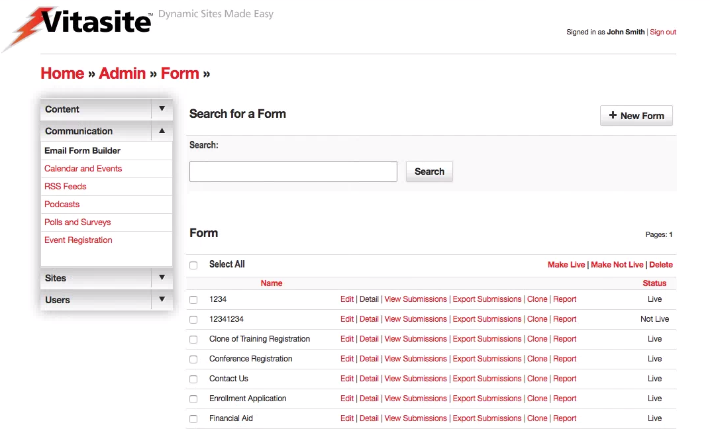

# Email Form Builder

Email Forms, sometimes called email response forms, are used to gather information from web site visitors. Visitors are asked to fill out a form, and the results are sent via email to you (or someone you choose) for action. Email Forms are often used on a web site’s “contact us” page to allow visitors to specify what they need, but can be used to gather any information you need.

The Email Forms tool can be accessed by selecting the "Email Form Builder" link that appears in the left side navigation, within the "Communication" section of all administrative pages. Alternatively, you can click on the “Email Form Builder" link in the body of the main administrative screen.

*Figure 1*

A representation of the Email Form Builder screen is shown in **Figure 1**. On this screen, you can see all the email forms in your site. The main Email Forms page is divided into two sections. The top section allows you to create a new email form.

The bottom section allows you to view or edit existing email forms.

## Understanding Form Options

Unlike other tools that simply have "Edit" and "Delete" commands for each item, Email Forms have additional form control options within the administrative screen. Below you can review the list of commands and what each does in relation to the form it is associated.

* **Edit** Similar to other tools, this allows editing of the form settings. However, the actual form is built within the *detail* section. Clicking save from this screen will automatically take you to the form field editor. These settings are described in [Step 1](#step-one-form-settings). As soon as you complete your edits, the form will be updated on all the pages of your site on which it is used.
* **Detail** Allows the administrator to edit the form fields. Defining fields is described in [Step 2](#step-two-defining-fields). As soon as you complete your edits, the form will be updated on all the pages of your site on which it is used.
* **View Submissions** This tool allows the administrator to view and manage all submissions to the form.
* **Export Submissions** This tool exports all submissions to the form in a CSV file. This file type can be opened in most spreadsheet or database applications.
* **Clone** Cloning a form allows you to make and exact duplicate of the form without any submissions. Useful for situations where you might want to separate out past submissions, in the case of a yearly registration form. The newly created form will appear in your list as "Clone of X" where X is the name of the cloned form. Note: the original form name may be truncated due to length restrictions.
* **Report** A powerful reporting tool, where the administrator can create on-demand reporting based on a number of factors as well as setting up reports to be emailed on a regular basis.

## Creating Forms

To create a new Email Form, click the “New Form” link at the top of the page.

### Step One: Form Settings

The first page allows you to set the following properties of the Email Form:

* **Form Title** This field allows you to set a title for identifying the form. This title is used in the administrative tools; it appears above the form on the web-site; and it is used in the subject line of the email sent when a user submits the form.
* **Email Address form will be set to** This field allows you to set the email address the form results should be sent to. When a user clicks the “submit” button, the data they entered on the form will be included in the body of the email.
* **Live** This checkbox determines whether this email form can be seen by your site visitors. If the email form is not live (the box is not checked), then visitors to your site will not see this email form. Once you make the email form live (by checking the box and saving your changes), VitaSite™ will make it available for your web site visitors to see. This functionality allows you to work with an email form in the administrative tools until you get it finished, without making it available on the site until it is ready.
* **Form Description or Instructions** This field allows you to provide information about the form, or instructions on how to use the form, to your site visitors.
* **Text to Display after Submission** This field allows you to provide a submission confirmation message to your site visitors. This text will be displayed after the user clicks the “Submit” button on your form. When you have completed these fields, click the “Save & Continue” button to proceed to the next page. This page allows you to setup the actual fields that appear on the form.

### Step Two: Defining Fields

When you first reach the field definition page, you will see a set of instructions explaining how to use these tools as shown in Figure 12. You can view these instructions at any time by selecting the “Instructions” option from the “Please choose the type of field you would like to add” menu.

Using the tools on this page, you can create any of the following types of fields:

* **Text Box** This field type allows you to provide a single- or multiple-line text area. This type is used to collect data such as name, address, or phone number.
* **Text Area** Text area fields allow you provide the user a multi-line text field for longer entry.
* **Check Box** This type allows you to provide a checkbox that can be used to collect yes/no type responses.
* **Radio Button** This type allows you to provide a series or mutually exclusive options for a user to select from.
* **Select List** This type allows you to provide a drop down menu of options for a user to select from.
* **Plain Text** This type allows you to insert descriptive text or instructions in the middle of your form. It is not used to collect data.

You can make any form field a required field by putting “\_req” at the end of the field description. For example, to make the text box for email address a required field, change the description to “Email Address\_req” in the form editor. The “\_req” part will not be displayed to the users of your form. Instead, they will see an asterisk,
indicating that a field is required.

When you have created a field for your form, click the “add” button to place it at the bottom of your current form. As you add fields, the field definition page will update to show you the form you are creating. Each added field will have several buttons next to it. These buttons perform the following actions:

* **Move up:** This button moves this field up one slot in relation to any other fields on the form around it.
* **Move down:** This button moves this field down one slot in relation to any other fields on the form around it.
* **Slot:** This button moves this field to a specific position in the form. Type in the number of the slot you want this item to appear in.
* **Edit:** This button opens the editor for that specific field type, allowing you to change the details of that field.
* **Delete:** This button deletes this field from the form.

Your work on the field definition page is saved as you make changes. Once you have completed your work on a form, you can go to another administrative page, or log out of the system.

To edit an existing form, click on the “edit” link next to the form name. The process for editing your form is then the same as described above for creating a form.

<!--## Form Reports-->

*[CSV]: Comma-separated values