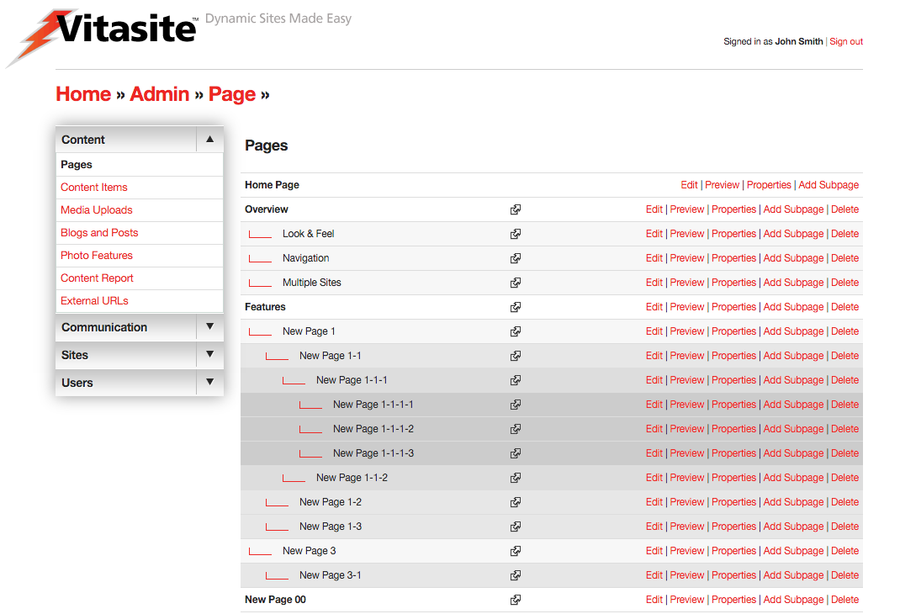
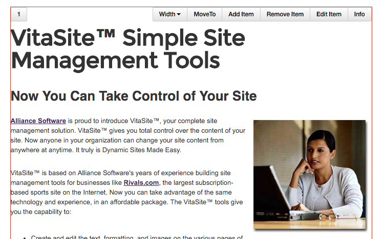

# Pages & Content

With VitaSite™, you organize your web site using Pages and Content. Pages are placeholders for information. [Content](content.md) is the information you put on those pages.

Think of Pages as an outline of your site. The top-level is your home page. Under that, you might have six or seven sub-pages that organize information about your company in a logical way. In turn, each of those sub-pages may have sub-pages under them as well, which further describe the information in that section.

For example, if we wanted to take this User Guide and make it into a website, then we might outline it into Pages and Sub-Pages as follows:

1. Home Page
    1. Pages
    1. Content Items
    1. Media Uploads
        1. Etc.
        1. Etc.

You might notice that the outline looks a lot like a Table of Contents. That is the point. Organizing your site into Pages and Sub-pages provides an organizational structure that makes it easy for your site visitors to find what they’re looking for.

Think of [content](content.md) as the “stuff” that goes on your pages. Content is usually text and images, but it can also be a streaming audio/video file, a PDF document, or something similar. Content is the message you’re trying to communicate through the pages of your site.

The tools described in the rest of this section allow you to manipulate pages and various types of content.

## Page Editor

The admin uses the Page Editor tool to create pages, edit page properties, edit the content on a page, and preview and delete pages. You can access the Page Editor by clicking on the “Pages” link in the left navigation bar in the "Content" section on any administrative page. Alternatively, you can click on the “Pages" link in the body of the main administrative screen.

*Figure 1*

You can see a representation of the main Page Editor screen in **Figure 1**. On this screen you can see all the pages in your site. The pages are arranged in a tree structure, with related pages grouped together, and with sub-pages indented under their respective parent pages. This arrangement makes it easy for you to find the page you need, and it helps you keep the content of your site organized.

Next to each page is a group of five buttons. Each button performs a specific function, as follows:

* **[Edit](#edit):** This button allows you edit the content that appears on the page.
* **[Preview](#preview):** This button allows you to preview a page and includes controls to allow for testing of a responsive website.
* **[Properties](#properties):** This button allows you to edit the properties of the page.
* **[Add Sub-Page](#add-sub-page):** This button adds a sub-page under the current page.
* **[Delete](#delete):** This button deletes the current page from the site.

## Edit

Click on the edit button to add, arrange or delete the content that appears on a specific page. When you click the button, a new browser window will open showing a representation of what the page will look like to your site visitors.

*Figure 2*

There are two functions available at the top of this page. (see **Figure 2**) The "Save" button saves any changes you have made to the page and closes the edit window, while the "Cancel" button discards any changes and closes the edit window.

*Figure 3*

On any given page there will be one or more areas, called content areas, which you can edit. If no items are on the page, the tool bar only displays an 'Add Item" button (see **Figure 3**), meaning that the only action you can take is to add an item to the page.

*Figure 4*

If there are existing items on a page, these areas are indicated by small numbers in the top left-hand side of each 'content' block. If you hover, or tap on a mobile device, a red outline will appear with an associated toolbar with each content item. gray header, as shown in **Figure 4**. Inside the content area there is a toolbar associated with each content item. There can be multiple items on a page, and each item will have its own toolbar. The full toolbar contains the following buttons:

* **Width:** Sets the item to a specific width to achieve a 'column' effect. See note below.
* **Move To:** Allows reordering of items on a page within a specific content zone. Set the number of the content item you want to move the existing one to. All other content items on the page shift downward.
* **Add Item:** Adds additional items to this page. Brings up the 'Add Item' dialog box.
* **Remove Item:** Removes this item from the page. However, it does not delete the item from the system. The item can still be used on other pages.
* **Edit Item:** Opens the editor for that specific item type (may not be available for every item type).
* **Info:** Identifies the item by Group, Item Name, and Item Key. This information may be helpful to your site administrator in the case you get stuck.

!!! note
    The **Width** button allows you to add 'column' effects for your content. By default, all content items placed on a page will take up the 'full-width' of the content area. Your VitaSite installation may have one or more options under this menu. The CMS will automatically determine the width and number of items of each row, using the widths you assign to each item. For instance, placing two content items with their width set to one-half (1/2) will result in a two-column effect. Any items that overflow the row will automatically drop under items in the current row. Be careful not to leave a row with an empty space, or to make items too small where they might be unusable to your users (e.g. Email Forms or Event Registrations).

It is important to remember that changes you make using these buttons are not saved until you click **Save** or at the top of the window, with the exception of changes made with the **Edit Item** button. This allows you to experiment with various items, without committing to those experiments until you are satisfied with the appearance of the page.

### The Page Insertion Wizard
The page insertion wizard allows you to quickly locate an item that you want to insert on the page. Each step of the wizard allows you to make a choice which narrows the options you see in the next step, leading to the last step of inserting a specific item onto the page. In this Users Guide, we will cover the page insertion wizard options that are common among all VitaSite installations. If your installation includes a plug-in, you may see additional options in the page insertion wizard.

In this example, we’ll follow the specific options for inserting a content item on this page. These are the same steps you will follow to insert other item types on the page, with the exception of the “filter” type. [Filters](#filters) work differently than the other item types, [and will be dealt with separately](#filters).

From the edit window for a page, you can click on an 'Add Item' button (either directly on a page or within an existing content item) to launch the page insertion wizard. This will open a new dialog window, with the first set of options.

**Step 1:** Choose the item type. There are several different types of items you can choose to insert. Each type is explained in the section of this guide devoted to the tools for that item. In most cases, you will be inserting a content item. For practice, choose **Content Item** from the list. The dialog will automatically go to the next page.

**Step 2:** Start typing the name of the item in the field at the top. The CMS will search through all items within that tool and retrieve the ones based upon your text. You may know this as an autocomplete or type-ahead function. Select the entry and then choose **Add Item**.

!!!note
    Choose the site. If you are working in a single-site environment, you will not see this option. In multiple site environments, this option allows you to choose content from a different site. The selection defaults to the site you are working on, the option you will choose most often. If you do select a different site, the dialog will refresh and the items from that tool will appear in the dialog box from Step 2.

The page insertion window closes, and the item you selected is added to the edit window. This item will not appear on the site until you click the **Save** button at the top of the page editor window.

Inserting items of other types works in the same way. You narrow your selection options by making choices in each step, until the item you want is inserted on the page.

### Filters

In step two of the page insertion wizard, you are given the option of choosing one or more filters. You may want to [learn about the general concepts of filters](/#filters) before adding your first filter. The following steps show how to insert a [**Content Filter**](content.md#content-filter) on a page:

From the edit window for a page, click on an **Add Item** button to launch the page insertion wizard. This will open a new browser window, with the first set of options.

**Step 1:** Choose “Content Filter” from the list and click “Next.”

**Step 2:** This step shows two panes. In the left pane, select the group or groups you want to pull items from by placing a check mark next to the group name. In the right pane, enter the number of content items that you want to display, choose whether or not to show summaries, then type in the headline you want to display over this content on the page. Once you have done this, click “Next.”

**Step 3:** The page insertion window closes, and the content filter you created is added to the edit window. This content filter will not appear on the site until you click the **Save** button at the top of the edit window.

Now, all you have to do to update the content displayed in the filter is add a new content item to one of the groups you selected to pull from for this filter. As soon as you save the content item, it shows up at the top of the filter and the oldest item disappears from the bottom of the filter.

## Preview

If your website is built with a <a href="https://en.wikipedia.org/wiki/Responsive_web_design" target="_blank">responsive design</a> (i.e. the site _responds_ to different device widths), the preview tools shown in **Figure 5** allows the admin to view their webpage within certain pre-defined responsive break points. The tool works whether or not the page is live and is only accessible to admins.

*Figure 5*

Once you have chosen **Preview** from the page admin page, you're presented with a view of your page scaled to the current browser window. Choosing a size along the top bar will size the page down to that specific window width, so you can make sure your page works and your page content does not overflow. For instance, 480 pixels (480px) is a common mobile size. Clicking it will resize your page to simulate devices whose screens are 480px wide. Choosing Reset will restore your page to the browser's full width.

## Properties

Click on the properties button to edit the properties of a page. The properties of a page are simply pieces of information about the page, like its name and its position within the site.

*Figure 6*

The properties page is shown in **Figure 6**. Changes made to page properties do not take effect until the “Save” button is clicked at the bottom of the page. Each of the fields is described below.

* **Page Link Name** – The page link name is used to identify the page in the administrative tools, and for any navigational links VitaSite creates to help your users find this page (such as the left navigation bar or in the breadcrumbs trail). This name should be descriptive, but short.
* **Page Title** – The page title defines what shows up at the top of the user’s browser window when they visit this page. This title should be consistent with the Page Link Name, but can be longer.
* **Restrict to User Group** – Restrict Access to User Group. Use this option to restrict access to this page. The default setting is “No Restriction,” which allows any site visitor to see this page. The second setting, “Any Registered User,” limits access to this page to registered users of the site only. If you have defined any user groups, those groups will also appear in this list. Choosing a user group will limit access to only members of that group. When a visitor navigates to a restricted page, they will be asked to provide their username and password before they can see the contents of the page.
* **Loose** – Loose Page. If this box is checked, then this page is removed from the normal site hierarchy and redefined as a loose page. Loose pages are not included in standard site navigational tools.
* **Parent** – This option allows you to move the current page, and any sub-pages under it, to a different part of the site. Choose the page from the list under which you want the current page to move. Site navigation will be updated automatically once you save this change.
* **Add Link in Utilities Section** – If your template includes a Utilities Link section, then checking this box will make a link to this page appear in that section.
* **Page Order** – This determines the order the pages are displayed in on the site and within the admin tools. If these are left blank, then the pages are displayed in the order in which they were created. Note that pages where the Page Order is left blank will appear before any pages where you have defined an order. Therefore, if you want to control the order of a section of pages, you must set the Page Order for all the pages involved.
* **Live on Site** – This check box determines whether this page can be seen by your site visitors. If the page is not live (the box is not checked), then visitors to your site will not see this page and VitaSite will not create links to it. Once you make the page live (by checking the box and saving your changes), VitaSite will create appropriate links to the page and make it available to your web site visitors to see. This functionality allows you to work with a page in the administrative tools until you get it finished, without making it available on the site until it is ready.
* **Page Group** – This option allows you to assign this page to a page group. Page groups are used to control administrative access. The “edit page groups” hyperlink next to this option allows these groups to be defined.
* **META Keywords** - This option is seldom used, but is still available. Advanced users can use this field to define the text that appears in the META keywords tag for the page. At one time, search engines used this tag to determine what search phrases were relevant for a given page. However, few search engines use this tag now. If no keywords are defined, then the page uses the META keywords tag defined in the template for this page, if any.
* **META Description** – This option is seldom used, but is still available. Advanced users can use this field to define the text that appears in the META description tag for the page. At one time, search engines used this tag to determine what search phrases were relevant for a given page. Many search engines still use this tag to show information about this page in search results. If no description is defined, then the page uses the META description tag defined in the template for this page, if any.
* **Site Association** - Overrides the navigation element of the page and associates this page's navigation list with the site selected. The page will be treated as a top-level page in the navigation and will not show in the list.
* **Override** - This along with the next two settings are used in coordination. This option overrides the navigation element, turning this page into a link. This is useful when you want a user to click on the page and navigate to something other than a page. Checking the box will enable the two options below. If it is unchecked, the next two options are ignored.
* **Override URL** - This is the URL that the user will navigate to when this page is clicked in the navigation list. This can be either a relative (e.g. '/somepage') or an absolute (e.g. '[http://www.vitasite.com](http://www.vitasite.com)') URL.
* **Link Type** - Controls how the link will open the URL above. By default, the URL will open in the same window, but can be changed to open in other ways (e.g. '_blank' will open the URL in a new Window or Tab depending on the user's browser preferences).
* **Slug** - If your Vitasite installation supports 'clean URLs' then this field controls the URL of your page. By default if the Slug is not provided one is created for you from the **Page Link Name**. Any text in this field is normalized to work in a URL, so spaces are converted to dashes ('-') and any characters not allowed in a URL are removed. Two pages on the same site cannot have the same slug. The system will try and create a non-conflicting slug for you by appending '-new' to your URL.
* **Mater File** – This option allows you to choose a different look and feel for this page. This setting will default to your site default, but may be overridden.

## Add Sub-Page

Clicking the “Add Sub-Page” button immediately adds a new sub-page under the current page and opens the properties screen for the new sub-page. The options for a sub-page are the same as described in the Properties section above.

If you do not define the properties of the new sub-page, it will be listed as “New Page” in the page editor until you either define the properties or delete the sub-page.

## Delete

Clicking the delete option displays a confirmation screen that asks if you want to delete or cancel. Choosing “delete” removes this page from the site permanently. However, any content contained on the page is not deleted, and can be used on other pages.

*[CMS]: Content Management System
*[PDF]: Portable Document File