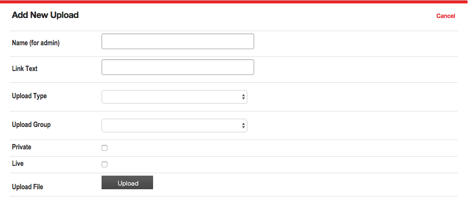
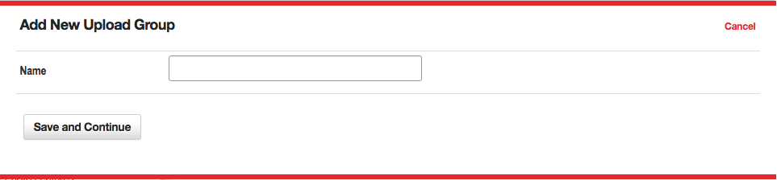
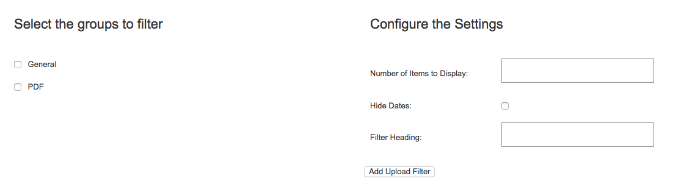

# Media Items

The Media Uploads tool is used to move various types of files from your local hard drive to the server hosting your web site, so that those files can be made available for use in content items and on pages. The Media Uploads tool allows you to upload image files, text documents, PDF files, streaming audio or video files, and other
document types.

To upload a Media Item, go to the Media Uploads tool by clicking “Media Uploads” in the left navigation bar of any administrative web page. An image of the main Media Uploads page is shown in **Figure 1**.

*Figure 1*

The lower part of the Media Uploads page shows items you have already uploaded in alphabetical order. You can change the sort order by clicking on one of the other column header links. Next to each item is a check box that allows you to perform certain actions on one or more content items. The actions that can be taken are shown in the “Action” menu at the start of the content item listing.

You can also view a subset of the media items by selecting a group name from the “Display media items from group” menu, and clicking “Submit.” This will show only those content items that are part of that content group. You may also search for a specific media item by using the "Search by name" field and searching for the name of the media item the admin provided.

Each upload allows you to perform actions on the existing upload, using Edit, Preview or Delete links. When you edit a upload, you may change any detail about the file, including uploading a newer version of the file to the site. Preview allows you to review an image on the server or to download any other type of file for review. The delete link will allow you do remove the file from the server permanently.

You can _create additional media groups_, or edit existing groups, by selecting the “Edit media groups” link near the “Display uploads from group” menu. (Learn more about [Media Groups](#media-groups).)

## Creating Media Uploads

To create a new Media Upload item, click the “New Upload” link at the top of the main Content Editor page. This will open a new wizard and display the fields for the process of creating a media upload.

*Figure 2*

The top section of the main Media Uploads page allows you to upload a new item, using the following information:

* **Name (for Admin)** – This name identifies the media item once you upload it.
* **Text to Display When Creating Links to Media** – This field is used only in specific cases where you need to insert a link to the item instead of inserting the item itself. In this case, this text is used as the hyperlink text. You can usually leave this field blank.
* **File Type** – Select the type of media file you are uploading.
* **Media Group** – Select the media group with which you want this file to be associated. You can create and edit media groups by using the “Edit Media Groups” link next to this menu.
* **File** – Click the "Upload" button to find the file on your local hard drive that you to want to upload. Once you have selected a file, this field will show the file to be uploaded just beneath the button.

Once you have selected a file to upload, you will want to wait for the progress indicator, just below the button, to finish and the word "completed" to appear. While the file is uploading you may continue to complete the necessary fields. Once the progress indicator shows complete, and you are finished filling out the necessary information, click the "Save and Continue" button to complete the saving process. The upload progress indicator may take some time, depending on the size of the file and your connection speed to the Internet, but is usually quick with smaller files.

If the file takes too long to upload (typically more than five minutes), you will receive a timeout error. In this case, you can try to upload your file again after decreasing the file size, or by using a faster Internet connection. A timeout error usually indicates that a media file is much too large to be used reliably over the Internet. However, in certain cases you may need to upload a large file. In these cases, you can request that your network administrator upload the file for you.

## Media Groups

As [with all groups](/#groups), **Media Groups** (shown in **Figure 3**) allow for an admin to organize their site's media uploads into specific "folders." Media groups can also be used to organize content for use in [Media Filters](#media-filters).

*Figure 3*

The "Name" box allows you to give a title to the specific Media Group.

## Media Filters

Media Filters are a powerful way of manipulating uploaded items, so that a page is updated automatically every time a new  item is created. If this is the first time you are setting up a filter, you might want to read the general concepts that apply to [all  filters](/#filters) within VitaSite. The following steps show how to insert a media filter onto a page:

### Filters Step One

From the edit window for a page, click on an 'Add Item' insertion button to launch the page insertion wizard. This will open a new dialog window, with the first set of options.

Choose “Media Filter” from the list in the page insertion wizard.

### Filters Step Two

*Figure 4*

This step involves two panes as seen in **Figure 4**.

* **Select the groups to filter** - In the left pane, select the group(s) you want to pull items from by placing a check mark next to the group name.
* **Max items to display per page** - In the right pane, enter the number of items that you want to display.
* **Hide dates** - Choose whether or not to show the item's date.
* **Filter Heading** - The headline you want to display over this filter on the page.

Once you have done this, click “Add Upload Filter.”

### Filters Step Three

The page insertion dialog closes, and the filter you created is added to the edit window. This filter will NOT appear on the site until you click either the “Save” button at the top of the edit window.

Now, all you have to do to update the media displayed in the filter is add a new media item to one of the groups you selected to pull from for this filter. As soon as you save the media item, it shows up at the top of the filter and the oldest item disappears from the bottom of the filter.